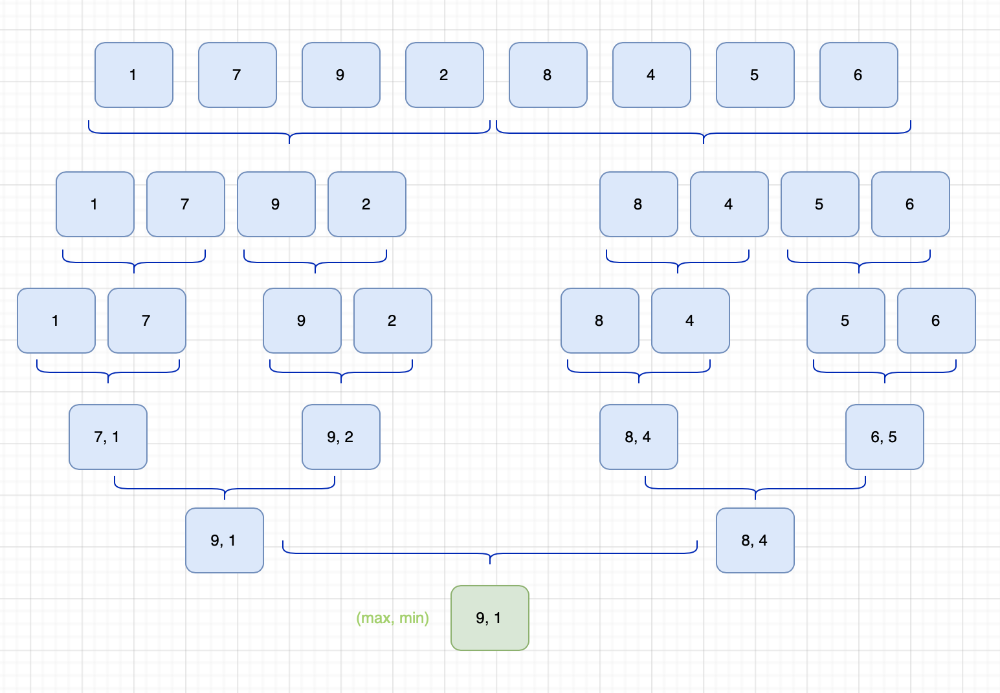

# Implementação do Algoritmo de Seleção Simultânea do Maior e do Menor Elemento

## Descrição do projeto

Este projeto implementa o algoritmo de seleção simultânea do maior e do menor elemento (maxmin select) em Python, utilizando a abordagem de divisão e conquista. O objetivo é reduzir o número de comparações necessárias em relação à abordagem ingêna, garantindo uma execução eficiente.

## Explicação do algoritmo

1. O problema é dividido em subproblemas menores.
2. Cada subproblema é resolvido recursivamente.
3. Os resultados são combinados para determinar o maior e o menor elementos da sequência.
4. O número de comparações é minimizado em relação a uma abordagem iterativa simples.

## Explicação do código

O código está implementado no arquivo `main.py` e segue a estrutura:

```python
# Implementação do algoritmo maxmin select

def maxmin_select(arr, left, right):
    if left == right: 
        return arr[left], arr[left]
    
    if right - left == 1: 
        if arr[left] < arr[right]:
            return arr[left], arr[right]
        else:
            return arr[right], arr[left]
    
    mid = (left + right) // 2 
    min1, max1 = maxmin_select(arr, left, mid) 
    min2, max2 = maxmin_select(arr, mid + 1, right)
    
    return min(min1, min2), max(max1, max2)  

if __name__ == "__main__":
    arr = [1, 7, 9, 2, 8, 4, 6, 5]
    minimum, maximum = maxmin_select(arr, 0, len(arr) - 1)
    print(f"menor elemento: {minimum}, maior elemento: {maximum}")
```

### Passo a passo do código

1. **Caso base**: Se o array contiver um único elemento, ele é retornado como máximo e mínimo.
2. **Caso com dois elementos**: O menor e o maior são determinados diretamente.
3. **Divisão e conquista**:
   - O array é dividido ao meio.
   - Recursivamente, os menores e maiores são encontrados em cada metade.
   - Os resultados são combinados, retornando o menor dos mínimos e o maior dos máximos.

## Como executar o projeto

### Requisitos
- Python 3.x instalado

### Passos para execução

1. Clone este repositório:
   ```bash
   git clone <url_do_repositorio>
   ```
2. Acesse a pasta do projeto:
   ```bash
   cd <nome_da_pasta>
   ```
3. Execute o código:
   ```bash
   python main.py
   ```

## Estrutura do projeto

```
<FPA_T2>/
│── readme.md  # Documentação do projeto
│── assets/
│   └── diagrama.png  # Diagrama da divisão e combinação
│── src/
│   └── main.py  # Implementação do algoritmo maxmin select
│   └── TestMaxMinSelect.py  # Testes do algoritmo maxmin select
```

## Relatório técnico

### Complexidade assintótica - contagem de operações

- Cada divisão reduz o tamanho do problema pela metade.
- Para `n` elementos:
  - O número de comparações é reduzido em relação à abordagem ingêna (`2n - 2`).
  - O total de comparações segue `3n/2 - 2`, resultando em `O(n)`.
  
Para `n` elementos:
- Ao dividir a sequência em dois subproblemas, cada um com `n/2` elementos, realizamos `2T(n/2)` chamadas recursivas.
- Cada nível da recursão realiza no máximo `2` comparações adicionais por chamada.
- Ao combinar os resultados dos subproblemas, realizamos apenas `2` comparações para encontrar o menor dos mínimos e o maior dos máximos.
- O número total de comparações para `n` elementos é aproximadamente `3n/2 - 2`, confirmando a complexidade `O(n)`.

### Complexidade assintótica - teorema mestre

A relação de recorrência do algoritmo é:

```
T(n) = 2T(n/2) + O(1)
```

1. Identificamos os valores:
   - `a = 2`, `b = 2`, `f(n) = O(1)`.
2. Calculamos `log_b a = log_2 2 = 1`.
3. Pelo teorema mestre, com `f(n) = O(n^c)`, onde `c = 0`, e comparando com `n^p`, onde `p = 1`, temos que `c < p`.
4. Pelo primeiro caso do teorema mestre (`f(n) = O(n^p)` com `p > c`), a solução assintótica é `O(n)`.

Como a complexidade `O(n)` é obtida diretamente do primeiro caso do teorema mestre, concluímos que o algoritmo mantém eficiência linear na busca pelo maior e menor elementos.

## Diagrama de divisão e combinação



## Conclusão

O algoritmo maxmin select é uma abordagem eficiente para encontrar o maior e o menor elemento simultaneamente em uma sequência de números. Sua estratégia de divisão e conquista reduz o número de comparações necessárias, tornando-o mais eficiente que a abordagem ingêna. O uso do teorema mestre confirma sua complexidade `O(n)`, garantindo bom desempenho mesmo para entradas grandes. A implementação recursiva segue um modelo claro e estruturado, sendo de fácil compreensão e manutenção.
